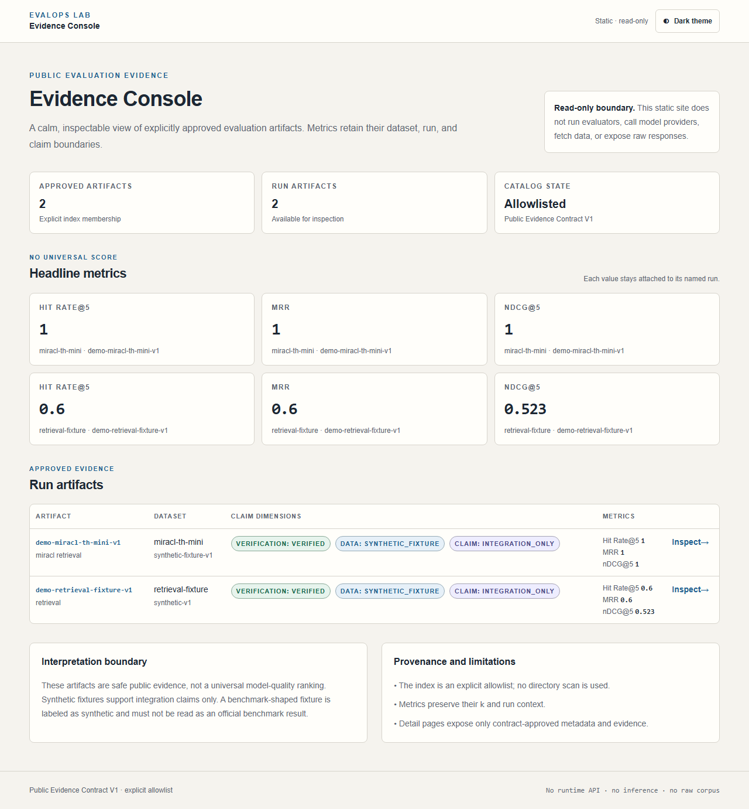
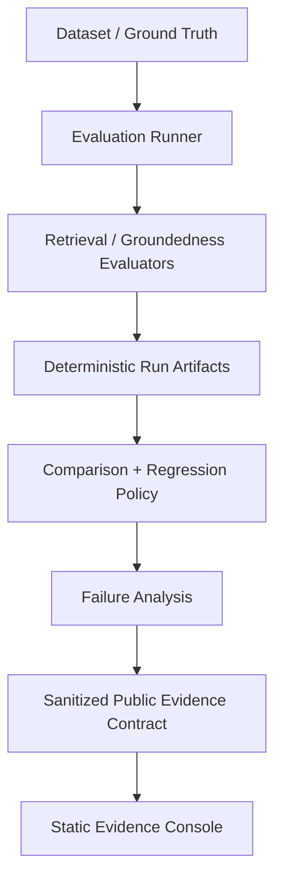
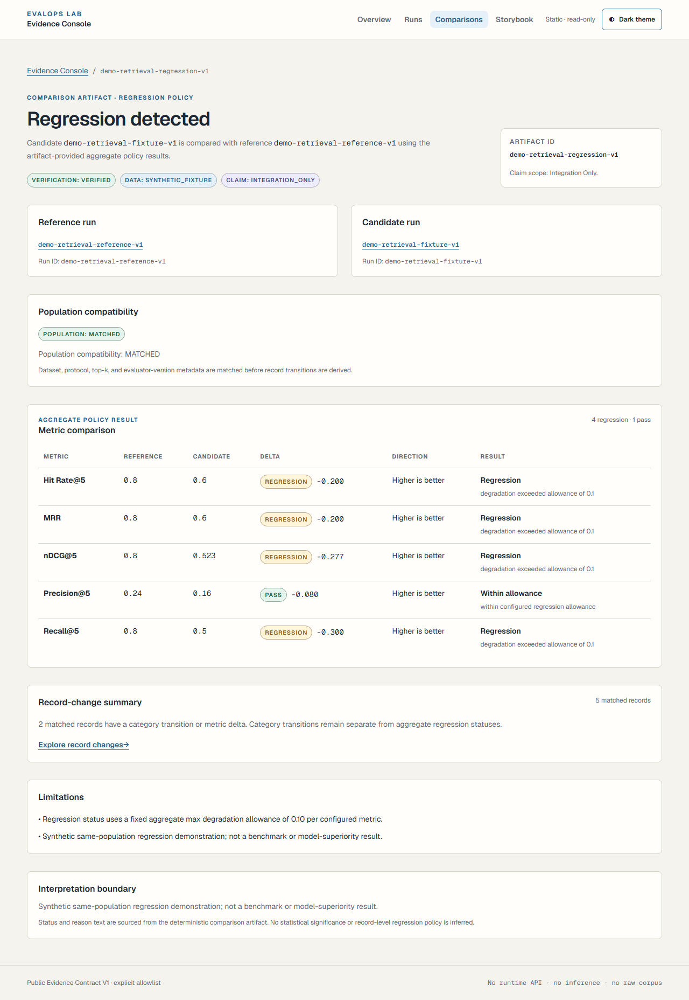
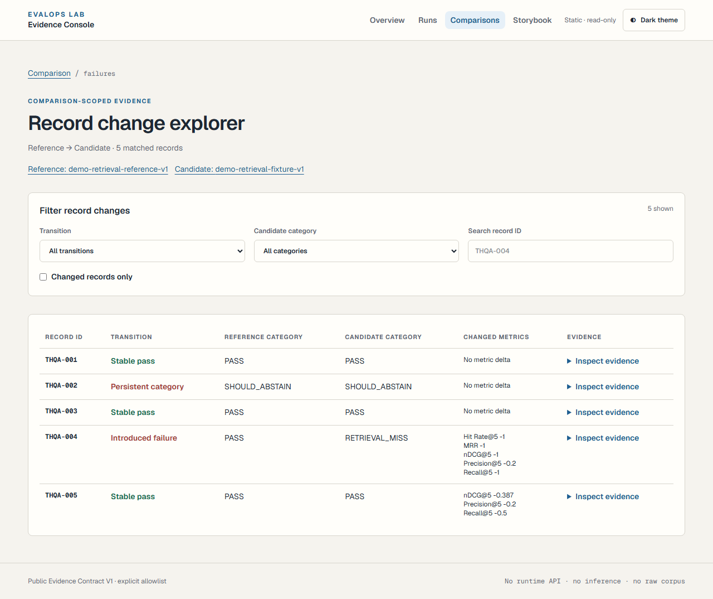

# EvalOps Lab

## A reproducible AI evaluation framework for evidence-backed engineering

EvalOps Lab evaluates RAG retrieval and groundedness as a software and data
quality problem: validate the data, preserve provenance, measure deterministic
signals, inspect failures, and make regression decisions against an explicit
policy.

[](https://github.com/Praciller/evalops-lab/actions/workflows/ci.yml)
[](https://github.com/Praciller/evalops-lab/actions/workflows/web-ci.yml)
[](https://github.com/Praciller/evalops-lab/actions/workflows/codeql.yml)
[](LICENSE)

**AI Evaluation · RAG Regression · Failure Analysis · Deterministic Evidence · Python / TypeScript · CI/CD**

## Start with the live evidence

<a href="https://praciller.github.io/evalops-lab/">Open the Evidence Console →</a>

Secondary proof: [Public Storybook](https://praciller.github.io/evalops-lab/storybook/)
for the curated evidence design system.

The console is a static, read-only presentation of explicitly allowlisted,
sanitized JSON artifacts. It does not run evaluators, call model providers, or
make production model-superiority claims.



*Production Evidence Console view with provenance and scope labels visible. The
public comparison data is `SYNTHETIC_FIXTURE` / `INTEGRATION_ONLY`.*

## Review EvalOps Lab in 90 seconds

1. **[Overview](https://praciller.github.io/evalops-lab/)** — verify that the
   public console exposes only the approved evidence bundle and shows its
   `VERIFIED`, `SYNTHETIC_FIXTURE`, and `INTEGRATION_ONLY` boundaries.
2. **[Regression Comparison](https://praciller.github.io/evalops-lab/comparisons/demo-retrieval-regression-v1/)**
   — verify that a reference/candidate pair from the same synthetic population
   is compared under an explicit regression policy.
3. **[Failure Explorer](https://praciller.github.io/evalops-lab/comparisons/demo-retrieval-regression-v1/failures/)**
   — inspect record-level transitions rather than relying on an aggregate score.
4. **[Architecture](#architecture)** — follow the path from ground truth to
   sanitized public evidence.
5. **[Tests & CI](#engineering-quality)** — reproduce the local checks and
   inspect the Python, Web, CodeQL, dependency, and Pages workflows.

## Why EvalOps Lab

Fluent output and a single aggregate score are not enough to support an
engineering decision. A useful evaluation needs ground truth, dataset and
system provenance, visible failure categories, and a policy that says when a
change is a regression. EvalOps Lab keeps those concerns separate so a reviewer
can trace a public claim back to a bounded artifact or a tested implementation.

## Evidence Matrix

| Capability | Evidence | Data kind | Claim scope | Verification |
| --- | --- | --- | --- | --- |
| Retrieval evaluation | [Runs catalog](https://praciller.github.io/evalops-lab/runs/) and deterministic metric tests | `SYNTHETIC_FIXTURE` for public demo | `INTEGRATION_ONLY` | [retrieval evaluators](src/evalops/evaluators/retrieval/) and [tests](tests/) |
| Regression decisions | [Comparison detail](https://praciller.github.io/evalops-lab/comparisons/demo-retrieval-regression-v1/) | `SYNTHETIC_FIXTURE`, same reference/candidate population | `INTEGRATION_ONLY` | [regression policy](src/evalops/regression/) and public artifact `VERIFIED` status |
| Failure investigation | [Failure Explorer](https://praciller.github.io/evalops-lab/comparisons/demo-retrieval-regression-v1/failures/) | `SYNTHETIC_FIXTURE` record transitions | `INTEGRATION_ONLY` | [failure taxonomy](src/evalops/failures/) and route tests |
| Public evidence isolation | [Public Evidence Contract](docs/specs/public-evidence-contract-v1.md) and checked-in [allowlist](apps/web/public/evidence/index.json) | Sanitized, explicitly indexed artifacts | Static presentation only | strict frontend schema and evidence-generation drift tests |
| Reproducibility and quality gates | [reviewer quickstart](#reviewer-quickstart), [reproducibility guide](docs/reproducibility.md), CI workflows | Offline fixtures and checked-in source | Local/CI verification, not a universal benchmark claim | Python, Web, Storybook, Playwright, axe, CodeQL, and Dependency Review gates |

## What this demonstrates

- **AI Evaluation Design:** dataset validation, provenance-aware run envelopes,
  deterministic retrieval metrics, and separated human/system/judge evidence.
- **RAG Retrieval Metrics & Regression:** Precision@K, Recall@K, Hit Rate@K,
  MRR, nDCG, baseline comparison, thresholds, and same-population decisions.
- **Failure Taxonomy and investigation:** record-level classifications and
  changed-only comparison views make failure transitions inspectable.
- **Evidence and claim quality:** a strict public contract, explicit artifact
  allowlist, literal scope labels, and fail-closed frontend validation.
- **Evaluation engineering:** typed Pydantic models, dependency-light Python,
  TypeScript/Zod public interfaces, and deterministic generated fixtures.
- **Delivery discipline:** Python/Web CI, public Storybook checks, browser and
  accessibility tests, CodeQL, Dependency Review, and static GitHub Pages.

## Architecture



The Python evaluation core is the source of truth. The static frontend reads
only the explicit `apps/web/public/evidence/index.json` allowlist and the
artifact files named by that index. It is read-only and fail-closed; it has no
API route, server action, inference path, provider credential, persistence,
analytics, or external runtime fetch.

### Trust & Limitations

`SYNTHETIC_FIXTURE` is not an official benchmark. `INTEGRATION_ONLY` is not
evidence of real-world model superiority. The public reference/candidate pair
demonstrates the evaluation, regression, and failure-analysis path on a bounded
fixture; it does not establish production retrieval performance.

The repository also contains protocol-specific benchmark work that is kept
separate from the public demo. See the [verified benchmark results](docs/benchmark-results.md),
[MIRACL guide](docs/miracl-benchmark.md), [RAGTruth guide](docs/ragtruth-benchmark.md),
[HHEM evaluator guide](docs/hhem-evaluator.md), and [LLM judge pilot record](docs/llm-judge-pilot.md).
Those documents preserve their own dataset, protocol, and execution scope.

## Selected production evidence

The following three views are curated to show the product path without turning
the README into a screenshot catalog.

### Regression comparison



*The public comparison shows a verified synthetic reference/candidate fixture;
its regression result is integration evidence, not an official benchmark.*

### Failure Explorer



*Record-level failure transitions are inspectable within the same
`SYNTHETIC_FIXTURE` / `INTEGRATION_ONLY` scope.*

## Engineering quality

- [EvalOps CI](.github/workflows/ci.yml) runs Python tests, lint, formatting,
  and type checks.
- [Web Evidence Console CI](.github/workflows/web-ci.yml) runs frontend lint,
  type checks, unit tests, Storybook publication checks, browser tests, and
  accessibility checks.
- [Pages deployment](.github/workflows/pages.yml) publishes only the static
  `apps/web/out` artifact and verifies the `/evalops-lab` path.
- [CodeQL](.github/workflows/codeql.yml) and [Dependency Review](.github/workflows/dependency-review.yml)
  are active repository checks.
- The active `main-governance` ruleset requires pull requests, resolved review
  threads, squash-only merges, required checks, and blocks deletion and
  non-fast-forward updates. Repository-wide security state is documented in
  [SECURITY.md](SECURITY.md).

## Reviewer quickstart

From a clean checkout, the deterministic offline path requires no paid service,
provider credential, or full external dataset:

```bash
python -m pip install -e ".[dev]"
pytest
ruff check .
ruff format --check .
mypy src
python -m evalops dataset validate datasets/fixtures/thai-rag-sample.jsonl --document-catalog datasets/fixtures/document-catalog.txt
python -m evalops retrieval evaluate --ground-truth datasets/fixtures/retrieval-ground-truth.jsonl --predictions datasets/fixtures/retrieval-predictions.jsonl --k 5
python -m evalops benchmark miracl --language th --split dev --retriever bm25 --k 5 --mini
```

The mini MIRACL command uses the clearly labeled synthetic `miracl-th-mini`
fixture. Its score is not an official MIRACL result.

For the frontend:

```bash
cd apps/web
npm ci
npm run lint
npm run typecheck
npm test
npm run build
```

The complete Storybook, Pages, browser, evidence-regeneration, external-dataset,
and opt-in evaluator protocols are documented in [CONTRIBUTING.md](CONTRIBUTING.md),
[AGENTS.md](AGENTS.md), and [docs/reproducibility.md](docs/reproducibility.md).

## Evaluation model

EvalOps Lab keeps the evidence chain separate:

1. Dataset manifests and validation establish what data is being evaluated.
2. Human labels remain distinct from system predictions and model-generated
   judge outputs.
3. Deterministic metrics and model-backed evaluators produce traceable results.
4. Failure analysis and regression comparison turn scores into engineering
   evidence.

The initial runnable path is retrieval evaluation. Generation remains a typed
interface for future adapters. The bounded Phase 5A LLM-as-a-Judge path is
opt-in and does not replace human ground truth or existing deterministic/HHEM
results. The local full-population protocol is documented separately and does
not authorize a new Gemini run or another model experiment.

## Datasets and benchmark scope

- **MIRACL Thai:** a pinned adapter and synthetic offline mini fixture; the
  full external corpus is not committed and the full dev BM25 run is not part
  of normal validation.
- **RAGTruth:** an adapter, pinned preparation, deterministic heuristic baseline,
  optional HHEM evaluator, and protocol-specific local results; external files
  remain outside Git.
- **HHEM-2.1-Open:** an opt-in model-backed evaluator with reviewed revision and
  weight-file safeguards; it is not imported by the default offline path.
- **thai-rag-eval-200:** five manually curated seed records, not a 200-case
  benchmark.

Dataset rules and manifests are in [datasets/README.md](datasets/README.md)
and [datasets/manifests/](datasets/manifests/). The canonical measured-result
summary is [docs/benchmark-results.md](docs/benchmark-results.md).

## Metrics and failure taxonomy

Retrieval metrics are implemented locally so formulas are visible and tested.
Sequence callers use binary relevance; MIRACL qrel mappings preserve positive
graded labels for nDCG. Duplicate retrieved IDs cannot create extra hits.
Precision retains `k` as its denominator when fewer than `k` results are
returned. Empty relevance sets score zero and are not silently treated as
successful retrieval.

Initial constrained failure categories include `PASS`, `RETRIEVAL_MISS`,
`WRONG_ANSWER`, `HALLUCINATION`, `UNSUPPORTED_CLAIM`, `WRONG_CITATION`,
`INCOMPLETE_ANSWER`, `CONTEXT_CONFLICT`, `SHOULD_ABSTAIN`,
`DATASET_AMBIGUOUS`, and `GROUND_TRUTH_ERROR`.

## Reproducibility and provenance

Every result envelope records run ID, dataset name/version, system name, top-k,
evaluator versions, optional model/provider/prompt/retriever details, random
seed, timestamp, and Git commit when available. Local evaluation requires no
paid service or API key.

External datasets and model weights stay outside Git. HHEM execution is opt-in,
pinned to one reviewed revision, and guarded by a manifest that checks the
tokenizer revision, configuration/custom-code hashes, and safe weight-file
identity before importing remote code. The repository does not redistribute
external MIRACL/RAGTruth corpora or HHEM weights.

See the [reproducibility guide](docs/reproducibility.md) for installation,
offline fixtures, opt-in external preparation, HHEM setup, and artifact
comparison.

## Roadmap

- Future: publish additional frozen benchmark baselines with their full
  protocol and provenance.
- Future: expand the curated Thai evaluation benchmark.
- Future: add code-generation and code-migration evaluator adapters.

Interactive evaluation running, external production benchmarks, and provider
inference are not presented as implemented features of the public console.

## Contributing, security, and license

See [CONTRIBUTING.md](CONTRIBUTING.md) for development gates and workflow,
[SECURITY.md](SECURITY.md) for security boundaries, and [LICENSE](LICENSE) for
the MIT license.

## Known limitations

The full MIRACL Thai dev BM25 run is not executed because the current in-memory
index resource requirements were not safely established. HHEM CPU inference is
slow, and threshold calibration/bootstrap intervals remain future work. The
completed local RAGTruth result is protocol-specific and is not a leaderboard
or universal generalization claim. MIRACL and RAGTruth mini fixtures are
synthetic and must not be presented as official benchmark performance.
