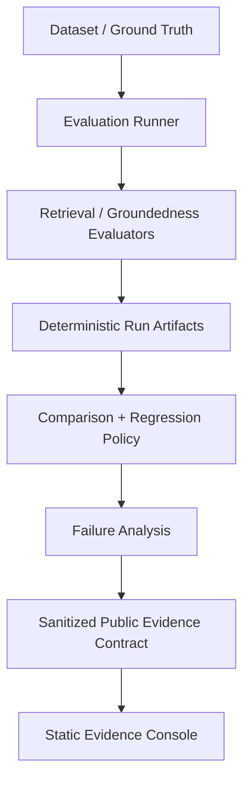

# Phase 5B.2 Recruiter Evidence Presentation Implementation Plan

> **For agentic workers:** REQUIRED SUB-SKILL: Use `superpowers:executing-plans` for this repository. Before source work, use `superpowers:using-git-worktrees` to create an isolated worktree from canonical `origin/main`. Do not use `subagent-driven-development` or delegate unless the owner explicitly requests delegation. Track execution with the checkbox steps in this plan.

**Goal:** Turn the repository README and GitHub metadata into an evidence-first recruiter funnel that demonstrates AI Evaluation Engineering capability within roughly 30–90 seconds, while preserving explicit claim limits, reproducibility, technical depth, and the existing static Evidence Console.

**Architecture:** Treat presentation as the final downstream layer of the existing trust chain: evaluation implementation → deterministic artifacts → sanitized public evidence → Evidence Console → README/GitHub metadata. Rewrite README using progressive disclosure, use only evidence-backed capability claims, link the 90-second path directly to live production routes, and capture final screenshots only from accepted production. Complete Phase 5B by synchronizing repository metadata, recording durable verification evidence, and creating `v0.1.0` only after every release gate passes.

**Tech Stack:** GitHub Markdown/Mermaid, GitHub Pages static Evidence Console, existing checked-in production screenshots, Python 3.11+/3.12, Node.js 22, Next.js 16.3.4, React 19.2.8, Storybook 10.6.0, Playwright Chromium, GitHub Actions/CodeQL/Dependency Review from accepted Phase 5B.1.

**Spec:** `docs/superpowers/specs/2026-09-06-phase-5b-repository-governance-recruiter-evidence-design.md`

**Precondition:** Phase 5B.1 must be accepted. README must not claim MIT detection, CodeQL, Dependency Review, PR-enforced `main`, squash-only policy, or other governance controls until their effective GitHub state is verified.

## Global constraints

- Preserve evaluation formulas, regression thresholds, run/comparison/failure semantics, and checked-in public evidence.
- Preserve explicit `SYNTHETIC_FIXTURE`, `INTEGRATION_ONLY`, and verification labels wherever current public evidence requires them.
- Never present the synthetic comparison as an official benchmark or evidence of production model superiority.
- Do not invent performance gains, adoption numbers, SLA claims, enterprise-readiness claims, or unsupported evaluator capabilities.
- Do not modify runtime product behavior merely to make the README look stronger.
- Do not add API routes, external model/provider calls, auth, persistence, analytics, databases, tracking pixels, or external font/media dependencies.
- Use only 2–3 curated production screenshots in the recruiter surface.
- Screenshot captions describe evidence, not marketing adjectives.
- README claims must be traceable to live public evidence, implementation, tests, CI, or documented contracts.
- Preserve detailed benchmark/research material in linked docs rather than deleting useful technical history merely to shorten README.
- Disambiguate the new repository-governance Phase 5B from older local experiment labels such as `Phase 5B-L`; do not let historical phase naming confuse the recruiter narrative.
- Do not create `v0.1.0` until all final release gates in this plan pass.

---

## Intended file/settings delta

Primary modification:

- `README.md`

Potential post-production closure modifications:

- `docs/screenshots/evidence-console/overview-desktop.png`
- `docs/screenshots/evidence-console/comparison-desktop.png`
- `docs/screenshots/evidence-console/failure-explorer-desktop.png`
- `DEPLOY.md`

Repository metadata changed after README acceptance:

- description
- homepage verification (retain current live Pages URL)
- concise repository topics

Final milestone action after all acceptance:

- GitHub Release/tag `v0.1.0`

No Python/npm package publication is part of this phase.

---

## Task 1: Establish a clean Phase 5B.2 base and prove Phase 5B.1 preconditions

**Files:** No source changes.

**Interfaces:** Git, repository rules/settings, CI/security state.

- [ ] **Step 1: Read execution skills**

Read `superpowers:using-git-worktrees` and `superpowers:executing-plans`. Do not invoke subagent delegation.

- [ ] **Step 2: Fetch canonical state without rewriting the ordinary checkout**

```bash
git fetch origin --prune
git status --short
git rev-parse HEAD
git rev-parse origin/main
```

Preserve any unrelated ordinary-checkout divergence.

- [ ] **Step 3: Create an isolated worktree**

```bash
git worktree add ../evalops-lab-phase-5b2 -b docs/phase-5b2-recruiter-evidence origin/main
cd ../evalops-lab-phase-5b2
git status --short
git rev-parse HEAD
git rev-parse origin/main
```

Expected: clean worktree based on canonical remote `main`.

- [ ] **Step 4: Confirm approved spec + both implementation plans exist on the base**

```bash
test -f docs/superpowers/specs/2026-09-06-phase-5b-repository-governance-recruiter-evidence-design.md
test -f docs/superpowers/plans/2026-09-06-phase-5b1-repository-governance-supply-chain-hardening.md
test -f docs/superpowers/plans/2026-09-06-phase-5b2-recruiter-evidence-presentation.md
```

Expected: PASS. If planning docs are not canonical yet, stop.

- [ ] **Step 5: Prove Phase 5B.1 effective state before writing governance claims**

Read fresh GitHub state and the 5B.1 acceptance record. At minimum independently verify:

```text
MIT detected
CodeQL active/green on accepted main
Dependency Review active/green
PR-required main ruleset active
review-thread resolution required
squash-only merge policy
force-push/deletion blocked
Wiki off
Discussions off
```

If any control is `UNVERIFIED`, README must not claim it as active.

**Commit:** none.

---

## Task 2: Build an explicit README claim inventory before rewriting presentation

**Files:**

- Read: `README.md`
- Read: `AGENTS.md`
- Read: `DEPLOY.md`
- Read: `docs/benchmark-results.md`
- Read: `docs/reproducibility.md`
- Read: `docs/llm-judge-pilot.md`
- Read: `docs/specs/public-evidence-contract-v1.md`
- Read: `apps/web/public/evidence/index.json`
- Read: allowlisted public run/comparison artifacts named by the index

**Interfaces:** public evidence contract, source/test evidence, CI/governance proof.

- [ ] **Step 1: Inventory the current README headings and claims**

```bash
grep -n '^#\|^##\|^###' README.md
```

Then identify quantitative/capability/governance claims and links that a recruiter could interpret as proof.

- [ ] **Step 2: Classify meaningful claims using the approved audit model**

For each meaningful claim, assign:

```text
A = directly evidenced by public artifact/live console
B = implementation-derived and backed by source/tests/CI
C = bounded inference requiring careful wording
D = unsupported; remove
```

Maintain this audit in execution notes or PR description; it does not need to become a permanent repository file unless useful.

- [ ] **Step 3: Audit public evidence truth from the explicit index**

Read `apps/web/public/evidence/index.json` and only the allowlisted artifacts. Confirm exact current values for:

- artifact IDs;
- `verification_status`;
- `data_kind`;
- `claim_scope`;
- comparison population compatibility;
- regression/pass counts;
- failure-transition examples used by README captions/links.

Do not source public claims from internal reports that the Evidence Console intentionally does not publish.

- [ ] **Step 4: Audit existing historical benchmark/LLM-judge material for recruiter placement**

The current README contains detailed MIRACL/RAGTruth/HHEM and local `Phase 5A-L` / `Phase 5B-L` experiment material. Preserve truthful documentation by linking to the dedicated docs, but move phase-history detail out of the first recruiter screens. Do not rename historical protocols in a way that changes their recorded meaning.

- [ ] **Step 5: Define the allowed evidence matrix rows before editing README**

Use only rows supported by the audit. Expected safe categories include:

- retrieval evaluation;
- deterministic regression detection;
- record-level failure transition analysis;
- public evidence isolation/sanitization;
- reproducibility/testing discipline.

If official benchmark results exist only in separate protocol-specific docs, represent them with their actual scope rather than conflating them with the public synthetic Evidence Console.

**Commit:** none.

---

## Task 3: Rewrite the README above-the-fold recruiter funnel

**Files:**

- Modify: `README.md`

**Interfaces:** production Evidence Console URLs; GitHub Actions badges/status pages where stable.

- [ ] **Step 1: Replace the current opening with the approved positioning**

The top should communicate approximately:

> A reproducible AI evaluation framework for RAG retrieval, regression decisions, failure analysis, and evidence-backed engineering.

Follow with one concise sentence explaining that deterministic evaluation artifacts are validated/sanitized before publication to the static read-only Evidence Console.

Do not use `enterprise-grade`, `best-in-class`, `production-proven performance`, or similar unsupported language.

- [ ] **Step 2: Make Live Evidence Console the primary CTA**

Use direct links to:

```text
https://praciller.github.io/evalops-lab/
```

Secondary navigation should point to the 90-second review section and architecture section. Storybook remains secondary proof, not a top-level competing CTA.

- [ ] **Step 3: Add compact capability signals and trustworthy status badges**

Capability signals may include only audited concepts such as:

```text
AI Evaluation · RAG Regression · Failure Analysis · Deterministic Evidence · Python / TypeScript · CI/CD
```

Use a small badge set whose status is independently meaningful, such as EvalOps CI, Web CI, Pages, supported Python, and MIT. Do not add vanity/custom badges that imply unsupported quality levels.

- [ ] **Step 4: Place the primary production screenshot near the top**

Initially reference:

```text
docs/screenshots/evidence-console/overview-desktop.png
```

Caption it as evidence/provenance context, not visual marketing. It may be refreshed after final production deployment in Task 9.

- [ ] **Step 5: Keep first-screen text compact**

Do not place installation commands, historical phase notes, exhaustive datasets, or detailed benchmark explanation before the recruiter path.

- [ ] **Step 6: Inspect only the opening diff**

```bash
git diff -- README.md
```

Confirm the first impression is AI Evaluation capability first, production engineering second.

---

## Task 4: Add the 90-second evidence path, Evidence Matrix, and competency translation

**Files:**

- Modify: `README.md`

**Interfaces:** live routes; public evidence labels; source/docs anchors.

- [ ] **Step 1: Add `Review EvalOps Lab in 90 seconds`**

Use the canonical order with direct live/deep links:

1. **Overview** — `https://praciller.github.io/evalops-lab/`
2. **Regression Comparison** — `https://praciller.github.io/evalops-lab/comparisons/demo-retrieval-regression-v1/`
3. **Failure Explorer** — `https://praciller.github.io/evalops-lab/comparisons/demo-retrieval-regression-v1/failures/`
4. **Architecture** — README internal anchor
5. **Tests & CI** — README internal anchor / GitHub workflow links

Each item must say what the reviewer should verify, not merely name a feature.

- [ ] **Step 2: Add a concise `Why EvalOps Lab` problem section**

Explain that fluent outputs/single aggregate scores are insufficient without ground truth, provenance, failure evidence, and regression policy. Keep this recruiter-readable and shorter than the current technical exposition.

- [ ] **Step 3: Add the Evidence Matrix**

Use columns equivalent to:

```text
Capability | Evidence | Data kind | Claim scope | Verification
```

Populate from Task 2 truth only. Preserve literal labels such as `SYNTHETIC_FIXTURE`, `INTEGRATION_ONLY`, `VERIFIED` where applicable. Never create a blank/ambiguous row that visually implies an official benchmark exists.

- [ ] **Step 4: Add `What this demonstrates`**

Translate implementation into evidence-linked competencies, such as:

- AI Evaluation Design;
- RAG Retrieval Metrics & Regression;
- Failure Taxonomy / record-level investigation;
- Evidence and Claim Quality;
- deterministic Python evaluation engineering;
- type-safe public evidence interfaces;
- CI/CD, accessibility, and production verification.

No stars, percentages, self-ratings, or unsupported seniority claims.

- [ ] **Step 5: Link each competency to concrete proof where practical**

Use links to source folders, tests, contract docs, live routes, or workflows rather than a technology badge cloud.

- [ ] **Step 6: Review matrix and competency language against the claim audit**

Every row/item must map to A/B/C; remove any D claim.

---

## Task 5: Replace architecture prose with one recruiter-readable evidence-flow diagram and explicit trust boundaries

**Files:**

- Modify: `README.md`

**Interfaces:** existing Python module boundaries, public export contract, Evidence Console.

- [ ] **Step 1: Add one GitHub-native Mermaid diagram**

Use a conceptual flow equivalent to:



Represent tests/CI as a cross-cutting validation annotation/subgraph only if it remains readable. Do not mirror every Python module.

- [ ] **Step 2: Add concise architecture boundary text**

State that the Python evaluation core remains the source of truth; the public frontend reads only allowlisted sanitized JSON and is static/read-only/fail-closed.

- [ ] **Step 3: Add visible `Trust & Limitations`**

Explicitly communicate:

```text
SYNTHETIC_FIXTURE != OFFICIAL_BENCHMARK
INTEGRATION_ONLY != real-world model superiority
```

Use normal prose/Markdown rather than mathematical notation if it reads better on GitHub. Explain that the synthetic reference/candidate pair proves the integration/regression/failure-analysis path, not production retrieval superiority.

- [ ] **Step 4: Preserve protocol-specific benchmark material through links**

Keep links to MIRACL/RAGTruth/HHEM/LLM-judge docs for technical reviewers, while moving detailed historical narratives lower or out of the recruiter flow. Do not silently erase verified protocol-specific results.

- [ ] **Step 5: Check Mermaid/Markdown syntax locally**

At minimum inspect fenced block pairing and headings. If a Markdown linter already exists, use it. Do not add a new package solely for formatting.

---

## Task 6: Add curated evidence screenshots, engineering proof, quickstart, and progressive-disclosure tail

**Files:**

- Modify: `README.md`

**Interfaces:** existing production screenshots and verified commands.

- [ ] **Step 1: Use only 2–3 curated production screenshots**

Preferred references:

```text
docs/screenshots/evidence-console/overview-desktop.png
docs/screenshots/evidence-console/comparison-desktop.png
docs/screenshots/evidence-console/failure-explorer-desktop.png
```

Do not add the entire screenshot catalog. Captions must retain synthetic/integration scope when the result view could otherwise be misread.

- [ ] **Step 2: Add compact `Engineering quality` proof**

List only active evidence-backed items. After 5B.1 acceptance this may include:

- deterministic evaluation;
- typed Pydantic/public Zod contracts;
- public artifact sanitization;
- Python/TypeScript validation;
- unit/integration/Playwright/axe checks;
- static GitHub Pages deployment;
- CodeQL + Dependency Review;
- PR-governed/squash-only `main`.

Link to workflows/tests/governance files where useful.

- [ ] **Step 3: Replace the long setup prominence with a reviewer-friendly quickstart**

Verify the exact commands from a clean checkout before publishing. Expected core path:

```bash
python -m pip install -e ".[dev]"
pytest
ruff check .
ruff format --check .
mypy src
```

Then include a concise frontend verification path:

```bash
cd apps/web
npm ci
npm run lint
npm run typecheck
npm test
npm run build
```

Link Storybook/Playwright/full reproducibility commands to `CONTRIBUTING.md`, `AGENTS.md`, and `docs/reproducibility.md` instead of duplicating all commands above the fold.

- [ ] **Step 4: Reorganize the README tail using progressive disclosure**

Keep useful technical material but reduce duplication. Suggested lower sections:

```text
Architecture / evaluation model
Trust & Limitations
Selected production evidence
Engineering quality
Quickstart
Datasets / benchmark docs (concise links)
Repository/deeper docs
Contributing
Security
License
Roadmap
```

Historical local experiment phase names belong in linked documents or a concise advanced-evidence note, not the opening recruiter story.

- [ ] **Step 5: Add contributor/security/license links**

Link `CONTRIBUTING.md`, `SECURITY.md`, and `LICENSE`. Do not claim private vulnerability reporting unless 5B.1 verified it.

- [ ] **Step 6: Keep roadmap honest**

Do not imply interactive evaluation runner, external production benchmark, or other future feature is already implemented. Label future work explicitly.

- [ ] **Step 7: Commit the README rewrite**

After review and local checks:

```bash
git add README.md
git commit -m "docs: make README recruiter evidence-first"
```

---

## Task 7: Verify README claims, links, commands, and full product baseline before opening 5B.2-A PR

**Files:** No additional intended modifications except corrections to `README.md`.

**Interfaces:** local clean-checkout reproducibility, public evidence generation, Web/Storybook/Pages tests.

- [ ] **Step 1: Run a no-placeholder/unsafe-path scan**

```bash
! grep -nE 'TODO|TBD|PLACEHOLDER|C:\\\\Users\\|/Users/[^/]+/' README.md
```

Expected: PASS. Do not interpret legitimate roadmap wording as a placeholder; adjust the regex only with documented reason.

- [ ] **Step 2: Check local Markdown links/files**

Use a small one-off Python script (not a committed dependency) to collect relative Markdown links/images from `README.md` and assert that referenced local files exist. Separately list HTTP links for live verification.

Expected: all relative file/image links resolve.

- [ ] **Step 3: Verify reviewer quickstart from the clean isolated worktree**

Run exactly the commands published in README. Expected: PASS without paid services, provider credentials, full external datasets, or local-only state.

- [ ] **Step 4: Run the full Python/evidence baseline**

```bash
pytest
ruff check .
ruff format --check .
mypy src
python -m evalops dataset validate datasets/fixtures/thai-rag-sample.jsonl --document-catalog datasets/fixtures/document-catalog.txt
python -m evalops retrieval evaluate --ground-truth datasets/fixtures/retrieval-ground-truth.jsonl --predictions datasets/fixtures/retrieval-predictions.jsonl --k 5
python -m evalops benchmark miracl --language th --split dev --retriever bm25 --k 5 --mini
python scripts/generate_public_demo_evidence.py
git diff --exit-code -- apps/web/public/evidence
```

Expected: all PASS, no public evidence drift.

- [ ] **Step 5: Run full Web/Storybook/Pages baseline**

```bash
cd apps/web
npm ci
npm run lint
npm run typecheck
npm test
npm run storybook:build
npm run storybook:build:public
node scripts/verify-public-storybook.mjs
npx playwright install --with-deps chromium
npm run storybook:test
npm run build
npm run test:e2e
npm run build:pages
npm run test:e2e:pages
cd ../..
```

Expected: all PASS.

- [ ] **Step 6: Re-run explicit claim audit on the final README diff**

Classify all meaningful new/retained claims A/B/C/D. Expected: no D claims. C claims must be bounded in wording.

- [ ] **Step 7: Inspect hygiene**

```bash
git diff --check
git status --short
git diff origin/main...HEAD -- README.md
```

Expected: intentional README-only source delta at this stage.

---

## Task 8: Open PR 5B.2-A and use it as behavioral proof of Phase 5B.1 rules

**Files:** PR metadata only.

**Interfaces:** GitHub ruleset, required checks, README rendering.

- [ ] **Step 1: Push and open PR**

Suggested title:

```text
docs: make EvalOps Lab recruiter evidence-first
```

Reference the Phase 5B.2 issue and approved spec. Include claim-audit summary and state that runtime/evaluation semantics are unchanged.

- [ ] **Step 2: Confirm the newly enforced required checks appear on this docs-heavy PR**

This is the legitimate behavioral proof that 5B.1 did not create a path-filter deadlock. Inspect final-head check runs and confirm the exact required contexts are present/successful, including Web CI, CodeQL, and Dependency Review as configured.

- [ ] **Step 3: Review real GitHub README rendering before merge**

Inspect the PR branch README on GitHub in light/dark themes and representative narrow/mobile viewport. Verify:

- Mermaid renders;
- table is readable;
- screenshots scale reasonably;
- heading anchors work;
- relative links resolve;
- CTA hierarchy remains clear;
- no fragile HTML layout tricks are required.

- [ ] **Step 4: Run the human 90-second acceptance review**

A reviewer unfamiliar with the repo should be able to answer:

1. what problem EvalOps Lab solves;
2. its main AI-evaluation capability;
3. where live evidence exists;
4. what the current evidence does **not** prove;
5. how engineering/CI/governance backs the claims.

If not, revise README rather than adding more marketing language.

- [ ] **Step 5: Merge 5B.2-A only after final-head proof**

Squash merge through the normal enforced PR path. Record PR number, final head SHA, merge SHA, required-check run IDs, and any accepted limitation.

---

## Task 9: Verify final production routes and refresh only the screenshots used by README

**Files:**

- Potentially modify: `docs/screenshots/evidence-console/overview-desktop.png`
- Potentially modify: `docs/screenshots/evidence-console/comparison-desktop.png`
- Potentially modify: `docs/screenshots/evidence-console/failure-explorer-desktop.png`

**Interfaces:** live GitHub Pages production, Playwright/axe/network observation.

- [ ] **Step 1: Trigger and wait for a Pages deployment from the accepted final 5B.2-A `main` SHA**

`README.md` is not currently included in the Pages workflow's automatic `push.paths`, so a README-only merge must not wait for a deployment that will never start. After the 5B.2-A merge, refresh `origin/main`, record its SHA, then dispatch the existing Pages workflow explicitly:

```bash
git fetch origin --prune
FINAL_5B2A_SHA=$(git rev-parse origin/main)
gh workflow run pages.yml --repo Praciller/evalops-lab --ref main
sleep 5
PAGES_RUN=$(gh run list --repo Praciller/evalops-lab --workflow pages.yml --branch main --event workflow_dispatch --limit 1 --json databaseId --jq '.[0].databaseId')
gh run watch "$PAGES_RUN" --repo Praciller/evalops-lab --exit-status
gh run view "$PAGES_RUN" --repo Praciller/evalops-lab --json headSha,conclusion,url
```

Expected: the dispatched run concludes `success` and its `headSha` equals `FINAL_5B2A_SHA`. Record the run/deployment URL. Do not capture localhost screenshots as final production proof.

- [ ] **Step 2: Verify all public recruiter/evidence routes against production**

At minimum:

```text
https://praciller.github.io/evalops-lab/
https://praciller.github.io/evalops-lab/runs/
https://praciller.github.io/evalops-lab/comparisons/
https://praciller.github.io/evalops-lab/comparisons/demo-retrieval-regression-v1/
https://praciller.github.io/evalops-lab/comparisons/demo-retrieval-regression-v1/failures/
https://praciller.github.io/evalops-lab/storybook/
```

Using Playwright against production, verify expected headings/evidence labels, representative axe result with zero violations, no root horizontal overflow at 390px, no unexpected external requests, and no internal/debug Storybook leakage.

- [ ] **Step 3: Confirm README deep links resolve to the production routes**

Check status/content, not merely URL syntax.

- [ ] **Step 4: Capture the three README production screenshots only if the existing assets are stale**

Capture from the live deployment at accepted SHA:

- Overview → `overview-desktop.png`
- Comparison detail → `comparison-desktop.png`
- Failure Explorer → `failure-explorer-desktop.png`

Use deterministic viewport and no UI/data manipulation. Keep evidence labels visible enough to preserve scope. Record route + canonical production SHA in execution notes.

- [ ] **Step 5: Inspect screenshots visually**

Confirm no cookie/browser chrome, private path, developer overlay, mock content, or misleading crop is present.

- [ ] **Step 6: If screenshots changed, create a separate 5B.2-B docs/evidence-only PR**

Do not mix runtime source changes into this closure PR. The PR may also include the durable deployment record from Task 10.

---

## Task 10: Record durable Phase 5B verification and synchronize recruiter-facing repository metadata

**Files:**

- Modify: `DEPLOY.md`

**Interfaces:** GitHub repository metadata/settings and production verification record.

- [ ] **Step 1: Add a concise Phase 5B production/governance verification block to `DEPLOY.md`**

Record actual values only:

- 5B.1 merge SHA;
- 5B.2 merge SHA;
- EvalOps/Web/CodeQL/Dependency Review/Pages run IDs;
- production verification date/time;
- live routes verified;
- ruleset/governance state summary;
- screenshot provenance;
- any platform/security limitation.

Do not overload README with run IDs.

- [ ] **Step 2: Define the final recruiter metadata from the audited project truth**

Preferred description direction:

```text
AI evaluation framework for RAG regression, failure analysis, and reproducible evidence.
```

Keep it concise enough for GitHub About. Homepage remains:

```text
https://praciller.github.io/evalops-lab/
```

Choose a concise truthful topic set from audited capabilities, likely a subset of:

```text
ai-evaluation
llm-evaluation
rag-evaluation
ai-engineering
reliability
testing
python
mlops
```

Do not keyword-stuff; omit any topic whose connection is weak.

- [ ] **Step 3: Read metadata immediately before mutation**

Use owner-authenticated `gh repo view`/API and record the existing description/homepage/topics.

- [ ] **Step 4: Apply only the approved metadata delta**

Use owner-authenticated GitHub tooling to set description/homepage/topics. Do not change visibility, Pages source, Issues, or governance settings here.

- [ ] **Step 5: Read metadata back after mutation**

Confirm description, homepage, topics, license, Wiki/Discussions, merge methods, and relevant ruleset still match final accepted state.

- [ ] **Step 6: Commit `DEPLOY.md` and refreshed screenshots in the docs-only closure PR if needed**

Suggested commit:

```bash
git add DEPLOY.md docs/screenshots/evidence-console
git commit -m "docs: record Phase 5B production verification"
```

If screenshots did not change, commit only the verification doc.

- [ ] **Step 7: Merge closure PR through the enforced normal PR path**

Required checks must pass. After merge, record the final canonical main SHA used for the release gate.

---

## Task 11: Execute the `v0.1.0` milestone release gate

**Files:** No source changes required.

**Interfaces:** Git tags, GitHub Releases, accepted canonical `main`.

- [ ] **Step 1: Confirm version metadata already matches the intended milestone**

Check:

```bash
grep -n '^version = "0.1.0"' pyproject.toml
node -e 'const p=require("./apps/web/package.json"); console.log(p.version)'
```

Expected: both currently `0.1.0`. Do not bump version merely to manufacture release work.

- [ ] **Step 2: Confirm there is no conflicting existing tag/release**

```bash
git fetch --tags
git tag -l 'v0.1.0'
gh release view v0.1.0 --repo Praciller/evalops-lab
```

Expected: no existing conflicting release/tag. If it exists, stop and inspect rather than force-replacing it.

- [ ] **Step 3: Evaluate every release gate with fresh evidence**

All must be true:

```text
5B.1 governance accepted
5B.2 recruiter presentation accepted
canonical main clean/known
EvalOps CI green on final main
Web CI green on final main
CodeQL green on final main
Dependency Review policy active/verified
Pages deployment green
production route verification PASS
README claim audit PASS
GitHub metadata synchronized
no unresolved relevant critical/high security issue
```

If any is not proven, do not release.

- [ ] **Step 4: Draft bounded release notes**

Release title can be:

```text
v0.1.0 — Recruiter-ready evidence-governed milestone
```

Notes may summarize:

- reproducible evaluation core;
- retrieval run/comparison/failure evidence;
- static public Evidence Console;
- Evidence Design System + public Storybook;
- governance/security hardening;
- explicit evidence limitations;
- live demo links.

Include a clear limitation that current public comparison evidence is synthetic/integration-scoped and is not a production model-superiority benchmark.

- [ ] **Step 5: Create the release targeting the exact accepted canonical main SHA**

Use owner-authenticated GitHub tooling, e.g.:

```bash
FINAL_SHA=$(git rev-parse origin/main)
gh release create v0.1.0 \
  --repo Praciller/evalops-lab \
  --target "$FINAL_SHA" \
  --title "v0.1.0 — Recruiter-ready evidence-governed milestone" \
  --notes-file <release-notes-file>
```

Use a temporary local notes file if needed; do not commit it unless useful documentation.

No Python/npm package publication is performed.

- [ ] **Step 6: Verify release/tag after creation**

```bash
gh release view v0.1.0 --repo Praciller/evalops-lab --json tagName,targetCommitish,name,isDraft,isPrerelease,url
git ls-remote --tags origin refs/tags/v0.1.0
```

Resolve the tag target to a commit and verify it equals the accepted final canonical main SHA.

- [ ] **Step 7: Verify release links and wording**

Open/read the public release and check live demo links. Confirm no stronger claim than README/public evidence was introduced.

---

## Task 12: Final Phase 5B acceptance artifact

**Files:** update durable verification doc only if the release itself must be recorded after creation; if so use one final docs-only PR and do not alter release target/source behavior.

- [ ] **Step 1: Assemble final evidence-backed classification**

Use actual values:

```text
PHASE_5B_CLASSIFICATION=<COMPLETE|COMPLETE_WITH_LIMITATIONS|BLOCKED|NOT_COMPLETE>

5B1_GOVERNANCE=<PASS|...>
5B2_RECRUITER_PRESENTATION=<PASS|...>

CANONICAL_MAIN=<sha>
RELEASE=v0.1.0
RELEASE_SHA=<sha>

EVALOPS_CI=<run>
WEB_CI=<run>
CODEQL=<run(s)>
DEPENDENCY_REVIEW=<run>
PAGES=<run>

LICENSE=MIT
MAIN_PR_REQUIRED=<YES|NO|UNVERIFIED>
SQUASH_ONLY=<YES|NO|UNVERIFIED>
FORCE_PUSH_BLOCKED=<YES|NO|UNVERIFIED>
DELETE_MAIN_BLOCKED=<YES|NO|UNVERIFIED>

README_CLAIM_AUDIT=<PASS|...>
PRODUCTION_EVIDENCE=<PASS|...>
TRUST_BOUNDARIES_PRESERVED=<YES|NO>
KNOWN_LIMITATIONS=<explicit list or none>
```

No optimistic placeholders in the final report.

- [ ] **Step 2: Re-read canonical repository state after release**

Verify `main`, tag/release, license, metadata, ruleset/settings, CI, and Pages state. A release does not supersede later incompatible changes; report the exact SHA relationship.

- [ ] **Step 3: Confirm recruiter acceptance one final time**

From the public GitHub repository page, verify a new reviewer can identify within ~90 seconds:

- project purpose;
- AI Evaluation capability;
- live proof route;
- evidence limits;
- engineering/governance proof.

- [ ] **Step 4: Close Phase 5B issues only after post-release evidence exists**

Implementation issues remain open until post-merge/release acceptance. Close them as completed only after final evidence is recorded.

---

## Final 5B.2 / release verification checklist

Before claiming Phase 5B complete:

- [ ] README first 1–2 screens are recruiter-first and AI-Evaluation-first.
- [ ] Live Evidence Console is the primary CTA.
- [ ] 90-second path works end-to-end.
- [ ] Evidence Matrix uses explicit data-kind/claim-scope/verification boundaries.
- [ ] `What this demonstrates` maps competencies to proof; no self-ratings.
- [ ] Mermaid architecture matches actual system boundaries.
- [ ] Trust & Limitations visibly distinguishes synthetic/integration evidence from official benchmark/model-superiority claims.
- [ ] only 2–3 curated production screenshots are prominent.
- [ ] screenshots come from final production and have traceable route/SHA provenance.
- [ ] reviewer quickstart passes from a clean isolated checkout.
- [ ] all relative README links/images resolve; production links work.
- [ ] final README claim audit contains no unsupported D claim.
- [ ] Python/evidence/Web/Storybook/Pages baseline remains green.
- [ ] representative live axe/mobile/network/Storybook publication checks pass.
- [ ] GitHub description/homepage/topics match recruiter positioning without keyword stuffing.
- [ ] 5B.1 controls are only described when independently verified.
- [ ] `v0.1.0` exists only after all gates pass and points to the accepted canonical main SHA.
- [ ] release notes preserve the same evidence limitations as README.
- [ ] no runtime/evaluation semantics or public data were changed for presentation.

## Completion handoff

Report the 5B.1/5B.2 PRs and merge SHAs, final canonical main SHA, all relevant CI/security/Pages run IDs, production route verification, metadata/ruleset state, release/tag target, claim-audit result, screenshot provenance, and explicit limitations. Only classify `COMPLETE` when every required gate is directly evidenced.